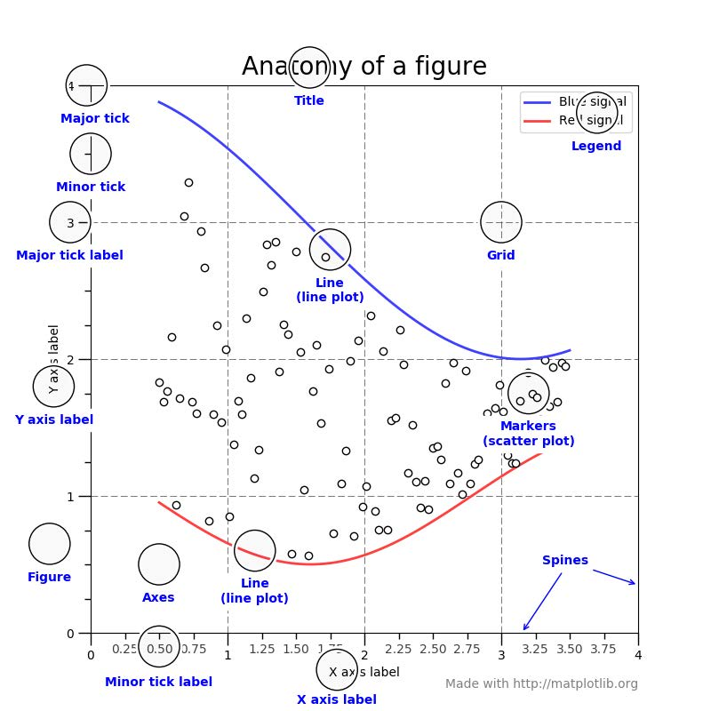
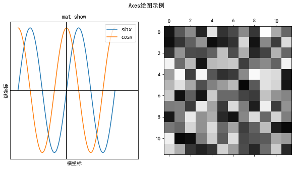
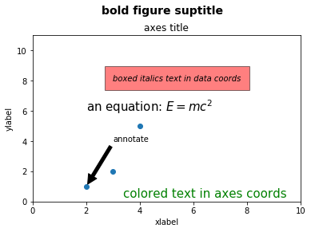

# Matplotlib

* 使用matplotlib.pyplot(plt)进行绘图时，有两种方法：

  1. 直接使用plt里的函数
  2. 使用面向对象的方法，先产生一个Axes对象，再对此对象进行操作，实现绘图

  > 第二种方法可以实现更多操作，具有更好的定制性。基于此方法绘图时，需要理解以下概念：
  >
  > 1. Figure：画布，Axes容器
  > 2. Axes：坐标系，绘图的区域，绘图总是在坐标系上进行；
  > 3. Axis：坐标轴，x轴或y轴。

<!--more-->

## Matplotlib Figure的各个部分



## 使用Axes的用法

```python
import matplotlib.pyplot as plt
plt.rcParams['font.sans-serif'] = ['SimHei']  # 中文字体设置-黑体
plt.rcParams['axes.unicode_minus'] = False  # 解决保存图像是负号'-'显示为方块的问题

x = np.arange(-2*np.pi, 2*np.pi, 0.01)
y1 = np.sin(x)
y2 = np.cos(x)

fig = plt.figure(figsize = (10,6))
# ax = fig.add_subplot(111)  
ax1, ax2 = fig.subplots(1,2)  
# 上面两行代码可以合并为一行，fig, (ax1,ax2) = plt.subplots(1,2, figsize = (10,6))

ax1.plot(x, y1, label='$sinx$')  #
ax1.plot(x, y2, label='$cosx$')
ax1.legend(loc='upper right')
ax1.set_xlim(-2 * np.pi - 1, 2 * np.pi + 3)
ax1.set_xticks([-2 * np.pi, -np.pi, 0, np.pi, 2 * np.pi])
ax1.set_xticklabels(['$-2\pi$', '$-\pi$', '$0$', '$\pi$', '$2\pi$'])
ax1.set_title('三角-函数')
ax1.set_xlabel('横坐标')
ax1.set_ylabel('纵坐标')
ax1.axhline(y=0, c='black')
ax1.axvline(x=0, c='black')

# 绘制矩阵灰度图
# 这里的matshow也可以换做imshow, 效果一样
# matshow只能绘制矩阵, imshow可以绘制矩阵(2维) RGB(3维) RGBA(4维图片)图像
ax2.matshow(np.random.randint(0, 255, (12, 12)), vmin=0, vmax=255, cmap='gray')
ax1.set_xticks([])
ax1.set_yticks([])
ax1.set_title("mat show")

# 设置父标题(画布标题),字体大小，字体粗细(bold:加粗)
fig.suptitle("Axes绘图示例", fontsize = 14, fontweight = 'bold') 

plt.show()

```



```python
import matplotlib.pyplot as plt
 
fig = plt.figure()
fig.suptitle('bold figure suptitle', fontsize=14, fontweight='bold')
ax = fig.add_subplot(111)
fig.subplots_adjust(top=0.85)
ax.set_title('axes title')
ax.set_xlabel('xlabel')
ax.set_ylabel('ylabel')
ax.text(3, 8, 'boxed italics text in data coords', style='italic',
        bbox={'facecolor':'red', 'alpha':0.5, 'pad':10})
ax.text(2, 6, r'an equation: $E=mc^2$', fontsize=15)
# ax.text(3, 2, unicode('unicode: Institut f\374r Festk\366rperphysik', 'latin-1'))
ax.text(0.95, 0.01, 'colored text in axes coords',
        verticalalignment='bottom', horizontalalignment='right',
        transform=ax.transAxes,
        color='green', fontsize=15)
ax.plot([2,3,4], [1,2,5], 'o')
ax.annotate('annotate', xy=(2, 1), xytext=(3, 4),
            arrowprops=dict(facecolor='black', shrink=0.05))
ax.axis([0, 10, 0, 11])
plt.show()
```



## subplot和subplots

### matplotlib.pyplot.subplot

* 调用subplot函数后，如下所示，创建一个nrows行，ncols列的Axes对象，然后返回在index位置的子图。

* 添加子图

  ```python
  subplot(nrows, ncols, index, facecolor, polar, **kwargs)
  ```
  
* nrows, ncols, index: 如果这三个数都小于10，则可以连写，`2,2,2`
  * facecolor: string型，如'b', 'w'等，这是子图的背景。
  * polar: bool类型，默认为False, 设置坐标是否为极坐标。
  
* 当然，如果想要对子图操作更加严格，按照网格来画，可以选择使用GridSpec。 `import matplotlib.gridspec as gridspec`,

### matplotlib.pyplot.subplots

*  subplots函数会返回一个figure对象和一个Axes对象：

  ```python
  def subplots(nrows=1, ncols=1, sharex=False, sharey=False, squeeze=True,
               subplot_kw=None, gridspec_kw=None, **fig_kw):
  ```

  * nrows and cols: 行和列的个数
  * sharex and sharey：决定是否共享x轴或y轴
  * **fig_kw: figure函数的参数都可以，如figsize、facecolor等。

  ```python
  fig,axes = plt.subplots(2,2)
  axes[0,0].plot(t1, np.exp(-t1) * np.cos(2 * np.pi * t1), 'r-', label = 'line')
  axes[0, 0].locator_params(nbins=10)     #控制x、y轴的标注位置，此处只用来控制标注个数
  axes[0, 0].set_xlabel('x-label', fontsize=fontsize)  #设置x轴的标签
  axes[0, 0].set_ylabel('y-label', fontsize=fontsize)  #设置y轴的标签
  axes[0, 0].set_title('Title', fontsize=fontsize)     #设置该子图的标题
  axes[0, 0].legend()                                  #添加图例
  axes[0,1].plot(t2, np.cos(2 * np.pi * t2), 'r--')
  axes[1,1].plot([1, 2, 3, 4], [1, 4, 9, 16])
  plt.show()
  ```

### 稍加修饰

`plt.tight_layout()`,可以解决各个子图标签、标题相互遮挡等问题

```python
plt.tight_layout(pad=0.4, w_pad=0.5, h_pad=1.0)
```

* pad: 分数(相对于font-size)，控制各个子图边界或figure边界的内边距。
* h_pad and w_pad: 单位为英寸，控制相邻子图的高或者宽的边距。

