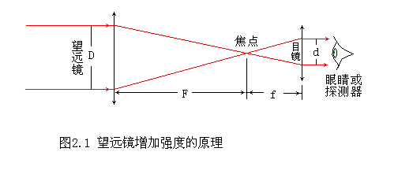
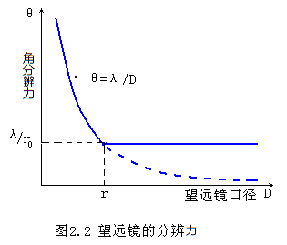
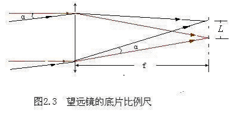
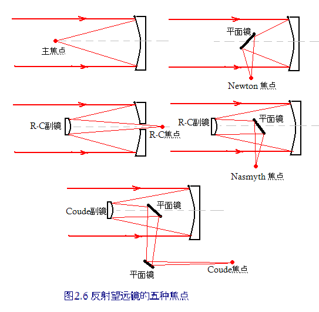

# 光学天文望远镜

## 1、望远镜的性能描述

1. 通光孔径

   * 通光孔径是指光可以通过的望远镜的直径，通过的光亮和直径的平方成正比

   * D/d = F/f = m，m称为放大倍数，在没有光损的前提下，光束所覆盖的面积减少到$1/m^2$倍，故所观测到的强度是原来的$m^2$倍，这就是天文望远镜的作用。收的光更多，看得更远。

     

   <!--more-->

2. 角分辨力

   * 理论上望远镜的分辨力是由它的口径决定的，如果口径为D，则分辨角$\theta = 1.22\lambda/D$($\lambda$ ——波长)。这个公式对射电望远镜同样适用。

   * 但在光学波段，当口径大到约10cm以后，由于大气视宁度的限制，地面望远镜口径增大并不能提高分辨力，如图2.2所示，在$D = r_0$(Frield参量)之后，分辨力是不变的，完全由视宁度决定，当然，如果用自适应光学，则可以达到或接近望远镜的理论分辨力。

     

3. 底片比例尺

   * 如图2-3所示，在天空成一定角度的$\alpha$的两个天体，在焦面上的像有一定的距离$L$,一般把$\alpha/L$称为比例尺(Scale)，单位通常用$''/mm$表示.

     

     显然，$L = f\alpha$.$f$为望远镜焦距(单位为$mm$)，故比例尺$ = \alpha/L = \alpha/f\alpha = 1/f = 206265''/f$  

     现在CCD普遍使用，很多人直接用每个像元多少角秒代替比例尺。设像元大小为$k$(单位$\mu m$)，则该CCD的比例尺为
     $$
     比例尺 = \frac{206265k}{1000f}(''/像元)
     $$

4. 焦比（相对口径）

   - 焦距$f$和口径$D$之比称为望远镜的焦比，即$F = f/D$ 或叫$F$数，甚至直接叫$F$，比如$F15$，也有人写成$F/15$，即焦距是口径的15倍。

   - 它的倒数叫相对口径$A$，$A = 1/F = D/f$。

   - 在焦面上，像的照度

     $$J = ID^2/f^2 = I/F^2 = IA^2$$

     $I$——入射光的照度  

     $J$——反映在探测器上每个像元上的能量的一个很重要的量  

     $F$越小，$J$越大，速度越快；反之，$F$越大，速度越慢。在用多通道做成像观测时(如CCD或照相底片等)是重要因素。但对于单通道(如单通道光电倍增管，或射电望远镜)，$J$只取决于$D$。

5. 视场

   * 能被望远镜良好成像的天空区域的角直径称为望远镜的视场
   * 所谓良好成像是指无晕，且像质达到要求。
   * 视场大的望远镜(比如折射望远镜和折反射望远镜，视场可达$10^。$左右)比较适合巡天和普查工作
   * 视场小的望远镜(如反射望远镜，视场一般不超过$1^。$)适合个别天体的精细观测研究。
   * 但在CCD普遍代替照相底片的今天，往往是探测器的尺寸限制了望远镜的使用视场。

6. 贯穿本领

   * 即常说的极限星等，更严格的是观测$A0$型星的极限星等。

7. 光能集中度

   * 上面这些性能是望远镜的整体参数，而衡量一架望远镜光学质量的最重要的指标叫做光能集中度，即扣除视宁度的影响后，点源天体的光在焦面上的能量分布，通俗的说即星象的大小。

## 2、折射望远镜

* 折射望远镜的光路
* 天体的光经折射镜在焦平面聚焦，由于制造的原因，典型的焦比$f/D$在15左右。
* 主要优点是，视场较大、焦距比较长、比例尺大，适合测量恒星的精确位置。
* 折射望远镜对温度的变化不敏感，光学调整好后可以维持很多年不需重调。
* 折射望远镜的视场可以达到几度，很适合进行天体自行等方面的研究。
* 世界上最大的折射望远镜只有1$m$(美国Wisconsin的Yerkes天文台)
* 限制折射望远镜尺寸的原因有
  * 第一、折射镜的支撑在边上，而最厚的中间部分没有支撑，自身重力的影响使镜面产生变形。
  * 第二、典型焦比为15，所以相应的镜筒长，观测室大，从而造价增加。
  * 第三，对短波吸收厉害，到近紫外几乎无法观测。

## 3、反射望远镜

### 1、反射望远镜的可用焦点

1. **主焦点**：主镜的焦点。只用凹面反射主镜成像，探测器在主镜前。主焦点的焦比$f/D$在1.5~4，速度快、光损小、视场较大，但探测器有部分挡光，操作也不太方便。

2. **牛顿焦点**：为克服主焦点的缺点，在主镜焦点前放一块和光轴成$45^。$的反射镜，将主焦点的光引到镜筒外成像，方便操作，一切参数和用主焦点一样。

3. **卡塞格林焦点**：在主镜和主焦点之间，放置一个凸形反射镜(称副镜或第二境)，组成双反射镜系统，两镜的光轴重合。光线在副镜反射后穿过主镜的中心孔，聚焦于主镜反射面的背后，这个焦点称为卡塞格林焦点，简称卡式焦点或卡焦。经典卡塞格林系统的主镜为抛物面，副镜是双曲面。现代的卡塞格林系统是Ritchey-Chretien(简称R-C)系统，其主镜和副镜均为准双曲面形，克服了传统卡焦系统的球差和慧差，视场明显加大；由于副镜是凸镜，使焦距加长，一般的$f/D$为7~15，焦距称为等值焦距，使从主镜反射面到焦点的光路长度远比等值焦距短，从而镜筒和观测室的尺寸大为减小。

4. **Nasmyth焦点**：也称耐焦，卡焦在主镜后面，安装终端设备的空间和重量都受到一定的限制。为此，仿照牛顿焦点，用一块和光轴成$45^。$的平面反射镜，置于主镜和副镜之间，将卡焦的光转到Nasmyth平台(一个或两个)，平台和望远镜同步绕垂直轴旋转(所以是用于地平式机架)，那里可以放更重、更大的设备。所有参数的优缺点与卡焦的一样，最大的区别在于视场中的像的旋转的。

5. **折轴焦点**：也称Coudé焦点。其副镜也是凸镜，但其曲率半径比卡焦副镜的小，凸的更厉害，因此其等值焦距更长，一般的$f/D $在20~40左右，视场更小，大多为几个弧分。

   

* 卡焦、Nasmyth焦点和折轴焦点都有副镜，其功能是加长焦距，设系统的焦距是$f$，主镜的焦距是$f_1$,则$m=f/f_1$称为副镜的放大率。
* 由于地球的自转，天体都有周日运动，所以在位置固定的Nasmyth焦点，或是Coudé焦点，都有视场旋转问题。观测单个点源，则没有什么关系。但如果观测面天体，或者观测多个天体(比如星团、星云、彗星)，或者观测一个天区，一定要让被测对象的像在焦面上相对于探测器的位置是固定的。有两种途径解决：用光学方法或者机械方法抵消视场的旋转；让探测器和视场同步旋转。

