# BRDF（双向反射分布函数）

在计算机图形学领域，着色（Shading）是指根据表面或者多边形相对光源和相机的角度和距离来计算它的颜色的过程。不同的用途可以使用不同的着色算法，CAD等追求响应速度的交互式图形领域可以使用简单快速的着色算法，卡通油画等艺术效果可以使用非真实感（Nonphotorealistic）着色算法，而追求真实感的CG电影或游戏则可以使用基于物理建模的着色算法。

本文关注基于物理着色的BRDF模型，希望能将BRDF的来龙去脉讲清楚，并分析Cook-Torrance BRDF公式的推导过程。本人水平有限，如有错误，请不吝指教。

要模拟真实光照，我们先要弄清光照的现象。

<!--more-->

## 光照现象

光由光子组成，光子既具有粒子的特性，又表现出波的特性。从波的角度看，光是电磁波的一种，不同频率（波长）的光波能量不同，频率越高（波长越短），能量越高，频率越低（波长越长），能量越低，其中波长在380nm－780nm范围内的光波能被人类的视网膜感知到，这个范围的光波称为可见光，不同频率的可见光被人感知为不同的颜色，频率越高的光偏蓝，频率较低的光则偏红。

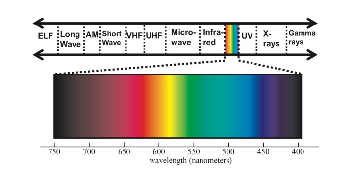

光学根据研究的尺度可以分为波动光学（Wave Optics）和几何光学（Geometric Optics），波动光学比几何光学复杂，而由于图形学领域关注的尺度远大于可见光的波长（380nm－780nm），也很少涉及光的偏振、干涉和衍射等波动光学才能解释的现象，所以我们一般用几何光学来建立光照模型。

### 光学平面边界上的散射

我们在中学物理课上学过光学平面边界的散射。

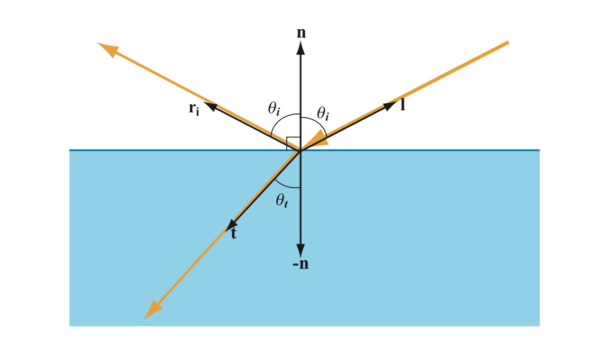

平面边界两边物质的折射率（Refractive Index）不同，当一束光线从一种物质照射到平面边界上时，其中一部分在平面边界被反射回这种物质，反射方向为入射方向关于平面法线的对称向量：

$$r_i = 2(n \cdot l) n - l $$

> 其中$r_i$是反射向量，$l$是光线入射向量，$n$是平面法线
>
> 向量间的$\cdot$表示向量的点积，两个单位向量的点积等于它们夹角的余弦。

另一部分光穿过平面边界折射进入另一种物质，折射方向可由Snell法则（Snell's Law）计算得出：

$$ \frac{\sin \theta_i}{\sin \theta_t} = \frac{v_i}{v_t} = \frac{\lambda_i}{\lambda_t} = \frac{n_t}{n_i} $$

> 其中下标$i$ 表示入射介质，下标$t$ 表示折射介质，$\theta$ 表示光线相当于边界法线的角度，$v$表示介质中的光速，$\lambda$表示介质中的波长，$n$表示介质的折射率。

反射和折射的比例由菲涅尔方程(Fresnel Equations)给出，菲涅尔方程比较复杂，图形学里一般使用近似公式计算。

## 非光学平面上的散射

现实世界中的表面绝大多数都是凹凸不平的，尽管这种凹凸不平小于肉眼可见的尺度，但远大于光线的波长。在这种情况下，可以把表面看成是大量朝向各异的微小光学平面的集合，我们肉眼可见的每个点都包含了很多个这样的微小光学平面。

光线照射到这些微小表面上时，同样***一部分在表面发生反射***。这些朝向不同的微表面把入射光线反射到不同的方向。

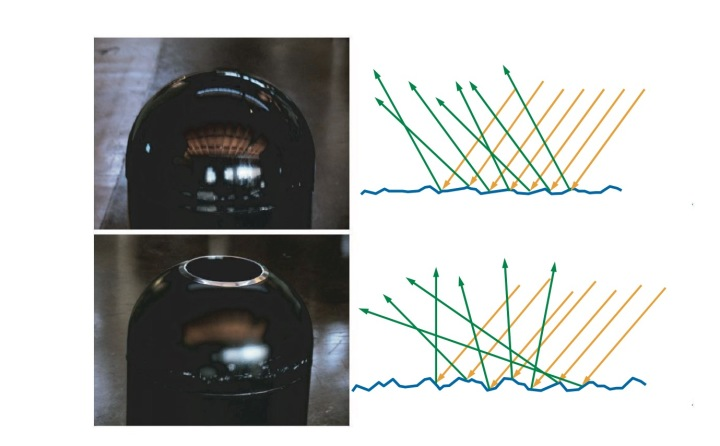

从上图可以看出表面粗糙程度对光线反射方向的影响。上面的物体表面相对光滑，微表面朝向差别较小，反射光线的方向差别也比较小，表面反射环境的图像比较锐利。下面的物体表面比较粗糙，微表面朝向差别大，反射光线的方向差别也比较大，表面反射环境的图像比较模糊。

***另一部分光线发生折射***，折射光线何去何从取决于物质的组成成分。

对于玻璃等透明物质，光线穿透玻璃，在另一边再次发生反射折射，图形学用双向透射分布函数BTDF来模拟这种现象，以后有机会再写。下面我们看看不透明和半透明物质。

对于金属，折射进表面的光线的能量会立即被金属中的自由电子吸收，转换成电子的能量，不再可见（下图左边）。对于非金属（电介质或绝缘体），它们往往不是由单一成分构成，而可以认为其中包含了很多折射率不同的微粒，光线遇到这些粒子后发生反射折射，在物质内部不断传播，散射到不同方向，其中一部分会再次穿过表面被观察到，这种现象称为次表面散射（Subsurface Scattering，下图右边穿出表面的蓝色光线），也有一部分在传输过程中被吸收。

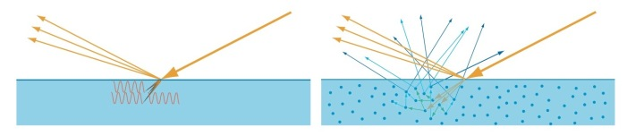

根据物质属性和观察尺度的不同，次表面散射会表现出不同的效果。

如下面的左上图，如果光线在物质中传播距离小于观察尺度（绿色区域，可以认为是一个像素区域），我们看到情况如下面的右上图，入射点、反射点、次表面散射的出射点看起来是同一个点。其中反射部分（图中浅棕色出射光）就是我们常说的高光（Specular Light），常聚集在一个方向周围，向这个方向观察该点会看到明显的高光，从其他方向观察该点时高光则比较微弱；次表面散射部分（图中蓝色出射光）是漫射光（Diffuse Light），光线被散射到各个方向。双向反射分布函数BRDF就是用来模拟这种现象的，这也是本文关注的重点。

如果光线在物质中的传播距离大于观察尺度，如下面的下图，就需要使用次表面散射算法来建模，[@文刀秋二](https://www.zhihu.com/people/59827f0a435d7b054c8339422dde6773) 写了一篇很好的[关于次表面散射的文章](https://zhuanlan.zhihu.com/p/21247702?refer=graphics)。

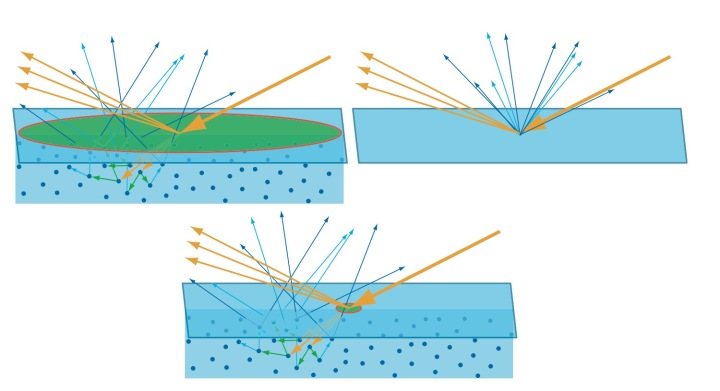

## 光照模型

为了模拟非光学平面的散射，人们建立了各种模型，大致可以分为以下几类：

### 1.测量模型

MERL等实验室使用仪器测量了上百种真实材质表面在不同光照角度和观察角度下的反射数据，并记录在[MERL BRDF Database](https://link.zhihu.com/?target=http%3A//www.merl.com/brdf/)等数据库中。这些数据由于采集自真实材质，所以使用它渲染出来的结果很真实，但缺点是没有可供调整效果的参数，无法基于这些数据修改成想要的效果，另外部分极端角度由于仪器限制，无法获取到数据，而且采样点密集，数据量非常庞大，所以并不适合游戏等实时领域，一般可用在电影等离线渲染领域，也可以用来做图形学研究，衡量其他模型的真实程度。

### 2. 经验模型

经验模型并不是基于物理原理，而是提出经验公式，通过调整参数来模拟光照。

1975年Phong提出Phong反射模型（Phong Reflection Model） ：

$$I_{Phong} = k_a I_a + k_d (n\cdot l) I_d + k_s (r \cdot v)^{\alpha} I_s$$

> 其中下标$a$表示环境光（Ambient Light），下标$d$表示漫射光（Diffuse Light），下标$s$表示高光（Specular Light），$k$表示反射系数或者材质颜色，$I$表示光的颜色或者亮度，$\alpha$可以模拟表面的粗糙程度，值越小越粗糙，越大越光滑。
>
> 反射向量$r$根据光线入射向量$l$相对法线$n$做反射得到：$r = 2(n \cdot l)n - l$

Phong模型中，漫射光和高光分别会根据入射方向$L$、反射方向$R$和观察方向$V$的变化而变化，还可以通过$\alpha$参数来调节表面粗糙程度，从而控制高光区域大小和锐利程度，而且运算简单，适合当时的计算机处理能力。

1977年Blinn对Phong模型做出修改，这就是后来广泛使用的Blinn-Phong反射模型：

$$I_{Blinn - Phong} = K_a I_a + k_d (n \cdot l )I_d + k_s (n \cdot h)^{\alpha} I_s$$

> 其中半角（Half-Angle）向量$h$是光线入射向量$L$和观察向量$V$的中间向量：$h = \frac{l + v}{|| l+v ||}$ 

Blinn-Phong相比Phong，在观察方向趋向平行于表面时，高光形状会拉长，更接近真实情况。

Blinn-Phong模型运算简单，适合早期硬件实现，在显卡只支持固定管线（Fixed Pipeline）的年代，Blinn-Phong模型是设计在显卡硬件中的，OpenGL/Direct3D固定管线的光照模型就是Blinn-Phong模型。但是Blinn-Phong模型毕竟只是一个经验模型，表现力有限，看起来有较重的塑料感。要想模拟各种不同材质的质感，得从光照的物理模型入手。

### 3.基于物理的分析模型

1967年Torrance-Sparrow在Theory for Off-Specular Reflection From Roughened Surfaces中使用辐射度学和微表面理论推导出粗糙表面的高光反射模型，1981年Cook-Torrance在A Reflectance Model for Computer Graphics中把这个模型引入到计算机图形学领域，现在无论是CG电影，还是3D游戏，基于物理着色都是使用的这个模型。我们将在下文中详细分析它的推导过程。

## 辐射度学基本量

图形学模拟可见光与各种材质的交互，这个过程涉及到能量的传输。辐射度学（Radiometry）是度量电磁辐射能量传输的学科，也是基于物理着色模型的基础。

我们看看常用的辐射度学的基本量。

### 1.能量

能量（Energy），用符号$Q$表示，单位焦耳（$J$）,每个光子都具有一定量的能量，和频率相关，频率越高，能量也越高。

### 2.功率

功率（Power），单位瓦特（Watts），或者焦耳/秒（$J/s$）。辐射度学中，辐射功率也被称为辐射通量（Radiant Flux）或者通量（Flux），指单位时间内通过表面或者空间区域的能量的总量，用符号$\Phi$表示，定义$\Phi = \frac{dQ}{dt}$。

### 3.辐照度和幅出度

辐照度（Irradiance），指单位时间内到达单位面积的辐射能量，或到达单位面积的辐射通量，也就是通量对于面积的密度。用符号$E$表示，单位$W/m^2$。定义为$E = \frac{d\Phi}{dA}$。

辐出度（Radiant Existance），也称为辐射出射度、辐射度（Radiosity），用符号M表示。辐出度与辐照度类似，唯一的区别在辐出度衡量的是离开表面的通量密度，辐照度衡量的是到达表面的通量密度。辐照度和辐出度都可以称为辐射通量密度（Radiant Flux Density）。

处理通量密度时，我们需要注意表面朝向和光线方向的角度。如下图所示，当光线垂直表面照射时，照射到表面上时的间距为$d$；而当光线倾斜照射表面时（光照向量$l$和表面法线$n$的夹角为$\theta_i$，间距为$d/\cos\theta_i$，光线间距相对垂直照射时变大了，也就是说倾斜照射时通量密度降低了。光照角度影响通量密度在我们日常生活中有很多实际例子，地球的季节变化就是因为光照角度变化，导致通量密度发生了变化。

假定不垂直于光线传输方向的表面面积为$A$，将它投影到垂直于光线方向得到一个虚拟表面，这个虚拟表面的面积为$A^{\perp} = A\cos\theta_i$，通过这两个面积的通量是相同的，均为$\Phi$，则表面接收到的辐照度$E = \frac{\Phi}{A}$，虚拟表面上的辐照度$E_L = \frac{\Phi}{A^{\perp}} = \frac{\Phi}{A\cos\theta_i}$，于是$E = E_L \cos\theta_i$。

点光源向四周辐射能量，假想以点光源为中心不同半径的球包围着点光源，穿过这些球的辐射通量是相同的，均为$\Phi$，而球的表面积为$4\pi r^2$ ，可得通量密度$E = \frac{\Phi}{4\pi r^2}$，也就是说通量密度与距离的平方成反比，离光源越远，通量密度越低，这也是为什么光的衰减与距离的平方成正比。

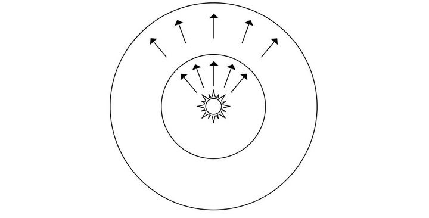

#### 4.辐射强度

​		讲辐射强度前，我们需要先知道立体角（Solid Angle）的概念，立体角可以看成是弧度的三维扩展。我们知道弧度是度量二维角度的量，等于角度在单位圆上对应的弧长，单位圆的周长是$2\pi$，所以整个圆对应的弧度也是$2\pi$ 。立体角则是度量三维角度的量，用符号$\omega$表示，单位为立体弧度（也叫球面度，Steradian，简写为sr），等于立体角在单位球上对应的区域的面积（实际上也就是在任意半径的球上的面积除以半径的平方$\omega = \frac{s}{r^2}$），单位球的表面积是$4\pi$，所以整个球面的立体角也是$4\pi$。

​		我们可以用一个向量和一个立体角来表示一束光线，向量表示这束光线的指向，立体角表示这束光线投射在单位球上的面积，也就是光束的粗细。如下图左边，向量l表示光源方向，微分立体角$d\omega_i$表示光束的粗细是无穷小。右边则表示面积光照到平面上的一点，立体角$\omega_L$不再是无穷小。

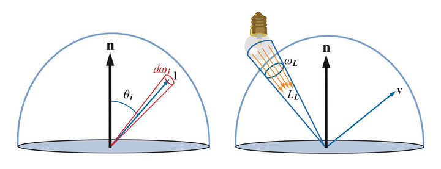

辐射强度（Radiant Intensity），指通过单位立体角的辐射通量。用符号$I$表示，单位$W/sr$，定义为$I = \frac{d\Phi}{d\omega}$。

之所以引入辐射强度，是因为有时候要度量通过一个点的通量的密度，但因为点的面积是0，无法使用辐照度，所以引入辐射强度。辐射强度不会随距离变化而变化，不像点光源的辐照度会随距离增大而衰减，这是因为立体角不会随距离变化而变化。

### 5.辐射率

我们常需要度量从一个微小面积表面出发，射向某个微小方向的通量（或者来自某个微小方向，照射到微小面积表面的通量），辐射率就是度量这种情况的量。

辐射率（Radiance），指每单位面积每单位立体角的辐射通量密度。用符号$L$表示，单位$W/m^2 sr$。定义为$L = \frac{d\Phi}{d\omega dA^{\perp}}$。其中$dA^{\perp}$是微分面积$dA$在垂直于光线方向的投影，如下图所示。

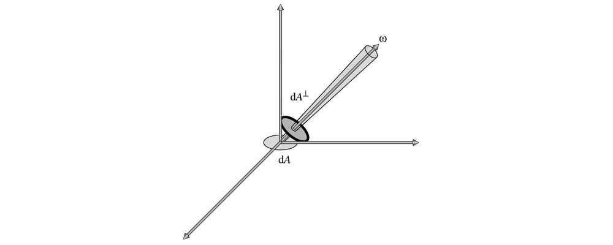

辐射率实际上可以看成是我们眼睛看到（或相机拍到）的物体上一点的颜色。在基于物理着色时，计算表面一点的颜色就是计算它的辐射率。

辐射率不会随距离变化而衰减，这和我们日常感受一致，在没有雾霾的干扰时，我们看到的物体表面上一点的颜色并不会随距离变化而变化。为什么辐照度会随距离增大而衰减，但是我们看到的颜色却不会衰减呢？这是因为随着距离变大，我们看到的物体上的一块区域到达视网膜的通量密度会变小，同时这块区域在视网膜表面上的立体角也会变小，正好抵消了通量密度的变化。

## BRDF

我们看到一个表面，实际上是周围环境的光照射到表面上，然后表面将一部分光反射到我们眼睛里。双向反射分布函数BRDF（Bidirectional Reflectance Distribution Function）就是描述表面入射光和反射光关系的。

对于一个方向的入射光，表面会将光反射到表面上半球的各个方向，不同方向反射的比例是不同的，我们用BRDF来表示指定方向的反射光和入射光的比例关系，BRDF定义为：

$$f(l,v) = \frac{dL_o(v)}{dE(l)}$$

> 其中$f$就是BRDF，$l$是入射方向，$v$是观察方向，也就是我们关心的反射方向。
>
> $\mathrm{d}L_o(v)$是表面反射到$v$方向反射光的微分辐射率。表面反射到$v$方向的反射光的辐射率为$L_o(v)$，来自于表面上半球所有方向的入射光线的贡献，而微分辐射率$dL_o(v)$特指来自方向$l$的入射光贡献的反射率。
>
> $\mathrm{d}E(l)$是表面上来自入射光方向$l$的微分辐照度。表面接收到的辐照度为$E$，来自上半球所有方向的入射光线的贡献，而微分辐照度$\mathrm{d}E(l)$特指来自于方向$l$的入射光。

表面对不同频率的光反射率可能不一样，因此BRDF和光的频率有关。在图形学中，将BRDF表示为RGB向量，三个分量各有自己的$f$函数。

BRDF需要处理表面上半球的各个方向，如下图使用[球坐标系](https://link.zhihu.com/?target=https%3A//en.wikipedia.org/wiki/Spherical_coordinate_system)定义方向更加方便。球坐标系使用两个角度来确定一个方向：

1. 方向相对法线的角度$\theta$，称为极角（Polar Angle）或天顶角（Zenith Angle）
2. 方向在平面上的投影相对于平面上一个坐标轴的角度$\phi$，称为方位角（Azimuthal Angle）。

所以BRDF也可以表示成$f(\theta_i,\phi_i,\theta_o,\phi_o)$。对于各向同性材质，当$l$和$v$同时绕法线$n$旋转时，$f$值保持不变，此时可以用$l$和$v$在平面投影的夹角$\phi$来代替$\phi_i$和$\phi_o$ : $f(\theta_i,\theta_o,\phi)$。

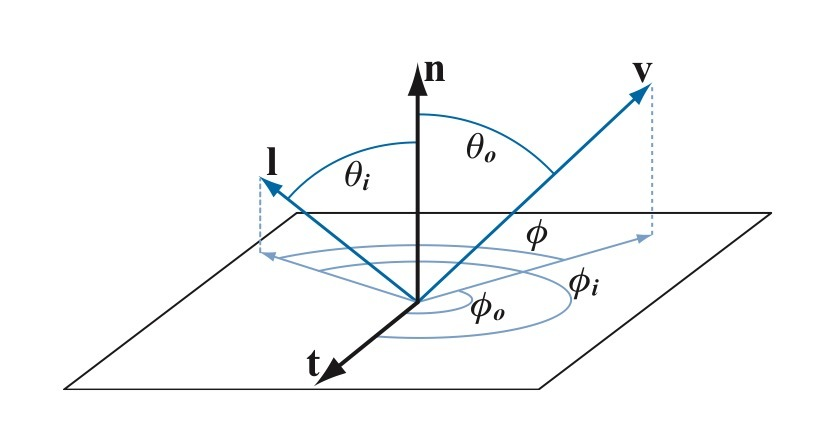

至于**为什么BRDF要定义成辐射率和辐照度的比值，而不是直接定义为辐射率和辐射率比值**，有两种解释。

***第一种解释***可以参看[brdf为什么要定义为一个单位是sr-1的量？](https://www.zhihu.com/question/28476602/answer/41003204)

我们结合下面辐照度（A）和辐射率（B）测量仪的示意图来看看。辐照度测量仪（A）接受平面上半球的所有光线，可以测量一个较小面积来自于四面八方的所有光通量，光通量$\Phi$除以传感器面积$A$就可以得到辐照度$E$。辐射度测量仪（B）则有一个长筒控制光线只能从一个很小的立体角进入测量仪，光通量$\Phi$除以传感器面积$A$和立体角$\omega$就可以得到辐射率$L$。

测平面上一点在某一个方向的出射辐射率很简单，只需要用仪器（B）从该方向对准该点就可以了。而测平面一点入射的辐射率则没有那么简单，必须保证光源正好覆盖测量仪开口立体角，大了该点会接受到比测量值更多的光照，导致测量值比实际值小，小了则与仪器的设计立体角不一致，可在实际中是基本做不到光源大小正好覆盖测量仪开口立体角的。而测表面的辐照度则简单得多，只要保证光源很小，而且没有来自其他方向的光干扰，这时候测到的辐照度就是平面上来自光源方向的微分辐照度$\mathrm{d}E$。

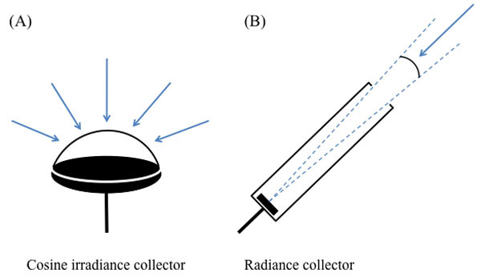

**第二种解释**从数学的角度触发，对于现实世界中的非光学平面，一束光线射到表面上后，被表面反射到各个方向，其中一个出射方向的光通量只是整个反射光通量极小的一部分，当出射方向立体角趋于0时，$\lim _{\omega_o \to 0} \frac{dL_o}{L_i} = 0$

，所以在实际计算中使用辐射率和辐射率比值是没有意义的。而如果分母改成表面上接收到的来自光源方向的微分辐照度，我们知道$dE = L_i(i)d\omega_i \cos \theta_i$，由于给入射辐射率乘了一个趋于零的微分立体角，$dE$的值会小很多，比值$\frac{dL_o}{L_i} = 0$是有意义的，而不是0.

下面我们来看看**怎么用BRDF计算表面辐照率**：

我们考虑来自方向$l$的入射光辐射率$L_i(l)$，由辐射率和辐照度的定义：

$$L_i(l) = \frac{d\Phi}{d\omega_i dA^{\perp}} = \frac{d\Phi}{d\omega_i dA \cos \theta_i} = \frac{dE(l)}{d\omega_i \cos \theta_i}$$

则照射到表面来自于方向$l$的入射光贡献的微分辐照度：

$dE(l) = L_i(l)d\omega_i \cos \theta_i$

表面反射到$v$方向的由来自于方向$l$的入射光贡献的微分辐射率：

$$dL_o(v) = f(l,v)\bigotimes dE(l) = f(l,v)\bigotimes L_i(l)d\omega_i \cos \theta_i$$ 

> 符号$\bigotimes$表示按向量的分量相乘，因为$f$和$L_i$都包含RGB三个分量。

要计算表面反射到$v$方向的来自上半球所有方向入射光线贡献的辐射率，可以将上式对半球所有方向的光线积分：

$$L_o(v) = \int_{\Omega}f(l,v)\bigotimes L_i(l)\cos \theta_i d\omega_i$$

上式称为**反射方程（Reflectance Equation）**，用来计算表面反射辐射率。

**对于点光源、方向光等理想化的精准光源（Punctual Light）**，计算过程可以大大简化。我们考察单个精准光源照射表面，此时表面上的一点只会被来自一个方向的一条光线照射到（而面积光源照射表面时，表面上一点会被来自多个方向的多条光线照射到），则辐射率：

$$L_o(v) = f(l,v)\bigotimes E_L\cos \theta_i$$

对于多个精准光源，只需要简单累加就可以了：

$$L_o(v) = \sum_{k=1}^{n}f(l_k,v)\bigotimes E_{L_k} \cos \theta_{i_k}$$

这里使用光源的辐照度，对于阳光等全局方向光，可以认为整个场景的辐照度是一个常数，对于点光源，辐照度随距离的平方衰减，用公式$E_L = \frac{\Phi}{4\pi r^2}$就可以求出到达表面的辐照度，$\Phi$是光源的功率，比如100瓦的灯泡，$r$是表面离光源的距离。

回头看看反射方程，是对表面上半球所有方向的入射光线积分，这里面包含了来自精准光源的光线，也包括周围环境反射的光线。处理来自周围环境的光线可以大幅提高光照的真实程度，在实时图形学中，这部分光照可以用**基于图像的光照（Image Based Lighting）**来模拟。我们将在下篇文章讨论基于图像的光照。

上面给出了BRDF的定义和使用BRDF计算表面反射辐射率的公式。但这个定义实际上是无法直接用于计算表面反射辐射率的，我们还要建立一个能模拟真实光照的模型，使得输入入射方向和出射方向，$f(l,v)$能输出表面反射微分辐射率和入射微分辐照度的比率。

1967年Torrance-Sparrow在Theory for Off-Specular Reflection From Roughened Surfaces中使用辐射度学和微表面理论建立了模拟真实光照的BRDF模型，1981年Cook-Torrance在A Reflectance Model for Computer Graphics中把这个模型引入到计算机图形学领域，现在这个模型已经成为基于物理着色的标准，被称为Cook-Torrance模型。下面我们来看看微表面理论和Cook-Torrance模型的推导过程。

## 微表面理论

微表面理论（Microfacet Theory）认为我们看到的表面上的一点是由很多朝向各异且光学平的微小表面组成。当光线从$l$方向照射到这点，而我们在$v$方向观察时，由于光学平面只会将光线$l$反射到关于法线对称的$v$方向，而$l$和$v$已经确定，所以只有法线朝向正好是$l$和$v$的半角向量$h$的微表面才会将光线发射到$v$方向（如下图，从而被我们看见）。

我们用**法线分布函数（Normal Distribution Function，简写为NDF）**$D(h)$来描述组成表面一点的所有微表面的法线分布概率，现在可以这样理解：向NDF输入一个朝向$h$,NDF会返回朝向$h$的微表面数占微表面总数的比例（虽然实际并不是这样，这点我们在讲推导过程的时候再讲），比如有1%的微表面朝向是$h$，那么就有1%的微表面可能将光线反射到$v$方向。

但实际上并不是所有微表面都能收到接受到光线，如下面左边的图有一部分入射光线被遮挡住，这种现象称为Shadowing。也不是所有反射光线都能到达眼睛，下面中间的图，一部分反射光线被遮挡住了，这种现象称为Masking。光线在微表面之间还会互相反射，如下面右边的图，这可能也是一部分漫射光的来源，在建模高光时忽略掉这部分光线。

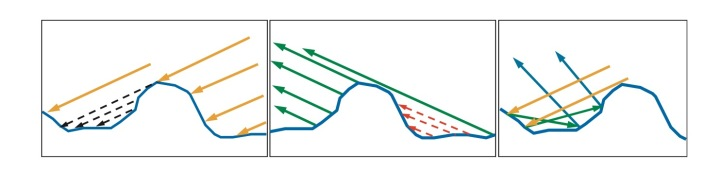

Shadowing和Masking用**几何衰减因子（Geometrical Attenuation Factor）**$G(l,v)$来建模，输入入射和出射光线方向，输出值表示光线未被遮蔽而能从$l$反射到$v$方向的比例。

光学平面并不会将所有光线都反射掉，而是一部分被反射，一部分被折射，反射比例符合**菲涅尔方程（Fresnel Equations）**$F(l,h)$

Torrance-Sparrow基于微表面理论，用上述三个函数建立了高光BRDF模型：

$$f(l,v) = \frac{F(l,h)G(l,v)D(h)}{4 \cos \theta_i \cos \theta_o} = \frac{F(l,h)G(l,v)D(h)}{4(n\cdot l)(n \cdot v)}$$

> 其中$n$是宏观表面法线，$h$是微观表面法线。

这个模型后来由Cook-Torrance引入计算机图形学，也被称为Cook-Torrance模型。不过Cook-Torrance的论文里上式分母里的系数由4改成了$\pi$，但现在大家公认应该用4，下面我们来看看这个公式的推导过程。

## Cook-Torrance模型公式推导

我们考察一束光照射到一组微表面上，入射光方向$\omega_i$，观察方向$\omega_o$，对反射到$\omega_o$方向的反射光有贡献的微表面法线为半角向量$\omega_h$，则这束光的微分通量：

$$\mathrm{d}\Phi_h = L_i(\omega_i)\mathrm{d}\omega_iA^{\perp} (\omega_h) = L_i(\omega_i) \mathrm{d}\omega_i \cos \theta_h \mathrm{d}A (\omega_h)$$

> 其中$\mathrm{d}A(\omega_h)$是法线为半角向量$\omega_h$的微分表面面积，$\mathrm{d}A^{\perp}(\omega_h)$为$\mathrm{d}A(\omega_h)$在入射光线方向的投影。$\theta_h$为入射光线$\omega_i$和微表面法线$\omega_h$的夹角。

Torrance-Sparrow将微分微表面面积$\mathrm{d}A(\omega_h)$定义为$\mathrm{d}A(\omega_h) = D(\omega_h)\mathrm{d}\omega_h \mathrm{d}A$

orrance-Sparrow将前两项解释为单位面积微表面中朝向为$\omega_h$的微分面积。不过这里塞一个$\mathrm{d}\omega_h$略诡异，我的理解乘以$\mathrm{d}\omega_h$并没有明确的数学或者物理上的意义。要从一组微表面面积$\mathrm{d}A$中得到的朝向为$\omega_h$的微表面面积$\mathrm{d}A(\omega_h)$，只需将$D(\omega_h)$定义微$\mathrm{d}A$中朝向为$\omega_h$的比例，取值范围在$[0,1]$就可以了。这里引入$\mathrm{d}\omega_h$的实际用途我们稍后再讨论。

由上两式可得：

$$\mathrm{d}\Phi_h = L_i(\omega_i)\mathrm{d}\omega_i \cos \theta_h D(\omega_h)\mathrm{d}\omega_h\mathrm{d}A$$

设定微表面反射光线遵循菲涅尔定理，则反射通量

$$\mathrm{d}\Phi_o = F_r(\omega_o)\mathrm{d}\Phi_h$$
