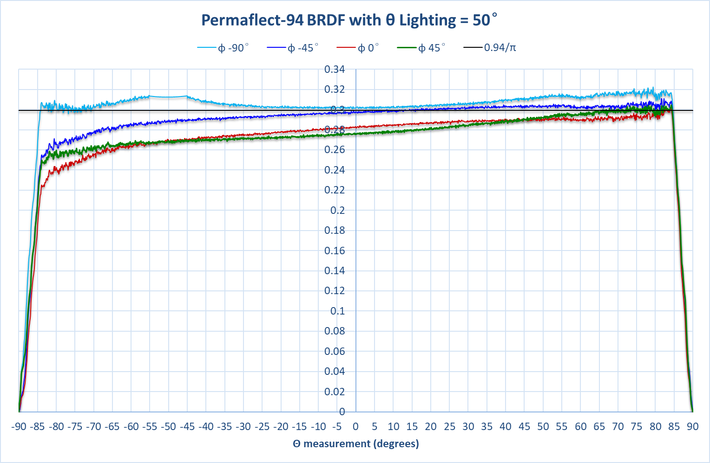

# 计算望远镜对LED的曝光时间

## 一个像元对应的幕布面积

### 焦面比例尺

* 主镜口径$D = 1600mm$
* 焦比$F = 4.5$
* 焦距$f = F\cdot D = 7200mm$
* 焦面比例尺$$\alpha = 206265''/f = 206265''/7200mm = 28.6479 ''/mm$$

<!--more-->

### 一个像元对应的幕布面积

* 平场幕布直径$sr = 1805 mm$
* 视场角$\varphi_v = 2°$
* 焦平面直径$fr = \varphi_v/\alpha = 251.327mm$
* 像元大小$k = 15 \mu m$
* 像元面积$ks = (15 \times 10^{-3})^2 = 2.25 \times 10^{-4}$

一个像元对应的平场幕布面积$ss = (\frac{sr}{fr} \times k)^2= 0.012 mm^2$

## 计算平场幕布处的辐照度

### 辐照度（Irradiance）

$$E_e = \frac{d\Phi_e}{dA}$$

### 幕布处的辐照度

* LED在$d_o = 200mm$处的辐照度为$E_{e0} = 21.9 \mu W/mm^2$
* 顶环距离幕布的距离$d_1 = 3926mm$

则LED在平场幕布处的辐照度为$E_{es} = E_{e0}\cdot d_0^2/d_1^2 \thickapprox 5.683\times 10^{-8} W$

### 辐亮度

$L_e$为辐射亮度，定义为某个辐射传播方向上单位面积面光源单位立体角内的辐射通量。例如，面积为$dA$的辐射面，在和表面法线成$\theta$角的方向上的立体角$d\Omega$内发出的幅通量为$d\Phi_e$，则辐射亮度$L_e$可以表示为$L_e = \frac{d\Phi_e}{\cos \theta dA d \Omega}$，单位是瓦特每球面度平方米，符号是$W/(sr \cdot m^2)$

* 双向反射函数BRDF定义为$f(l,v) = \frac{dL_o(v)}{dE(l)}$

> 其中$f$就是BRDF，$l$是入射方向，$v$是观察方向，也就是我们关心的反射方向。
>

* 平场幕布的BRDF约为0.3

* 则光经幕布反射后的辐亮度为$L_e = E_{es} \times 0.3$
* ~~主镜对应的立体角$\Omega = \pi \cdot (\frac{D}{2})^2 /(d_1+d_2)^2$，用主镜面积近似计算。~~
* 

则CCD一个像元所能接收的辐射通量为

$$\Phi_e = L_e \cdot ss \cdot \Omega = 0.3 \times E_{es} \cdot ss \cdot \Omega \thickapprox  1.7\times 10^{-8} W$$ 

### 一个光子所携带的能量

* 普朗克常数$h = 6.626 \times 10^{-34}$
* 波长625nm一个光子的能量$E_{photon} = h \cdot \frac{c}{\lambda} \thickapprox  3.18\times 10^{-19}$

### 计算望远镜对LED的曝光时间

* 望远镜在r波段带宽内效率均值（考虑滤光片）为55.63%
* Andor在650nm的量子效率约为72.9%

CCD一个像素对应面积每秒辐射的光子数为$n_p = \frac{\Phi_e}{E_{photon}} \cdot 55.63 \% \cdot 72.9\% = 14692408 $

**Andor相机的满阱容量典型值为$275,516 e^-$**

上述计算结果仅为一个LED灯的，计算结果量级差了三个量级

## 相关单位转换

* 毫瓦 $\to$ 瓦（$mW \to W$）

  $$1mW = 10^{-3}W$$

* 微瓦 $\to$ 瓦（$\mu W \to W$）

  $$1\mu W = 10^{-6}W$$

* 微米 $\to$ 毫米 $(\mu m \to mm)$

  $$1\mu m = 10^{-3} mm$$

* 纳米 $\to$ 米 $(nm \to m)$

  $$1nm = 10^{-9}m$$
