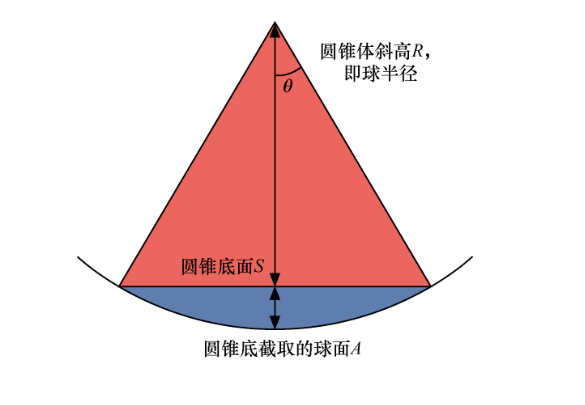
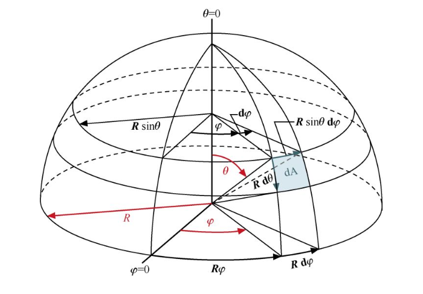

# 立体角

给定一个正球体，它的半径为$R$。然后给定一个正圆锥体，正圆锥体的顶点和球心重合，到圆锥底面圆边上任意一点的连线，即正圆锥体斜高，它的值也为$R$。由正圆锥体的底面圆$S$所截取的那一部分球面的面积$A$和球体半径$R$的平方的比称为立体角（solid angle），其国际单位是球面度（steradian）。下图展示了一个立体角的截面剖视示意图。

<!--more-->

若以$\Omega$表示立体角，则立体角的微分形式定义如下式所示。

$$d\Omega = \frac{dA}{R^2}$$

式中，$dA$为圆锥底面截取的球面$A$的微元。

若在球面坐标系下对立体角进行定义，如下图所示，面积微元$dA$的公式可以写为

那么由$dA = Rd\theta R\sin \theta d\varphi$，整个球面的立体角可写为关于$\varphi$和$\theta$的二重积分形式：

$$\Omega = \int{\frac{dA}{R^2}} = \int \int d\theta d\varphi \sin\varphi = \int^{2\pi}_0 d\varphi \int^{\pi}_0 \sin \theta d \theta = 4\pi$$
