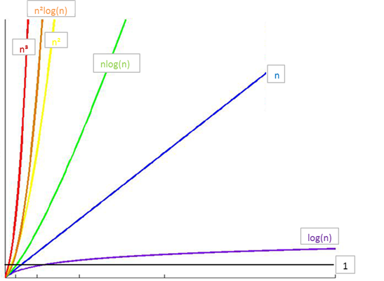
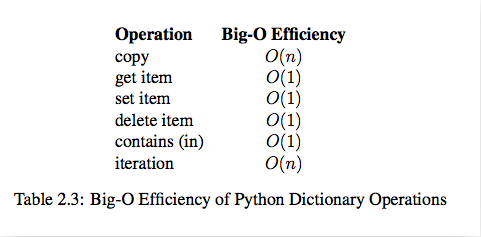

# 算法分析

1. 第一次尝试的算法核心部分

```python
for a in range(0, 1001):
    for b in range(0, 1001):
        for c in range(0, 1001):
            if a**2 + b**2 == c**2 and a+b+c == 1000:
                print("a, b, c: %d, %d, %d" % (a, b, c))
```

**时间复杂度：** $T(n) = O(n*n*n) = O(n_3)$

<!--more-->

2. 第二次尝试的算法核心部分

```pyth
for a in range(0, 1001):
    for b in range(0, 1001-a):
        c = 1000 - a - b
        if a**2 + b**2 == c**2:
            print("a, b, c: %d, %d, %d" % (a, b, c))
```

**时间复杂度：**$T(n) = O(n*n(1+1)) = O(n*n) = o(n^2)$

> 由此可见，我们尝试的第二种算法要比第一种算法的时间复杂度好多的。

# 常见时间复杂度

| 执行次数函数举例 |    阶    | 非正式术语 |
| ---------------- | :------: | :--------- |
| 12               |   O(1)   | 常数阶     |
| 2n+3             |   O(n)   | 线性阶     |
| 3n2+2n+1         |  O(n2)   | 平方阶     |
| 5log2n+20        | O(logn)  | 对数阶     |
| 2n+3nlog2n+19    | O(nlogn) | nlogn阶    |
| 6n3+2n2+3n+4     |  O(n3)   | 立方阶     |
| 2n               |  O(2n)   | 指数阶     |

# 常见时间复杂度之间的关系



所消耗的时间从小到大

$O(1) < O(\log n) < O(n) < O(n \log n) < O(n^2) < O(n^3) < O(2^n) < O(n!) < O(n^n)$

# list内置操作的时间复杂度


# dict内置操作的时间复杂度


