# 数据结构

> 我们如何用Python中的类型来保存一个班的学生信息？ 如果想要快速的通过学生姓名获取其信息呢？

实际上当我们在思考这个问题的时候，我们已经用到了数据结构。列表和字典都可以存储一个班的学生信息，但是想要在列表中获取一名同学的信息时，就要遍历这个列表，其时间复杂度为$O(n)$，而使用字典存储时，可将学生姓名作为字典的键，学生信息作为值，进而查询时不需要遍历便可快速获取到学生信息，其时间复杂度为$O(1)$。

我们为了解决问题，需要将数据保存下来，然后根据数据的存储方式来设计算法实现进行处理，那么数据的存储方式不同就会导致需要不同的算法进行处理。我们希望算法解决问题的效率越快越好，于是我们就需要考虑数据究竟如何保存的问题，这就是数据结构。

在上面的问题中我们可以选择Python中的列表或字典来存储学生信息。列表和字典就是Python内建帮我们封装好的两种数据结构。

<!--more-->

## 概念

**数据**是一个抽象的概念，将其进行分类后得到程序设计语言中的基本类型。如：`int, float, char`等。数据元素之间不是独立的，存在特定的关系，这些关系便是结构。数据结构指数据对象中数据元素之间的关系。

Python给我们提供了很多现成的数据结构类型，这些系统自己定义好的，不需要我们自己去定义的数据结构叫做Python的内置数据结构，比如列表、元组、字典。而有些数据组织方式，Python系统里面没有直接定义，需要我们自己去定义实现这些数据的组织方式，这些数据组织方式称之为Python的扩展数据结构，比如栈，队列等。

## 算法与数据结构的区别

数据结构只是静态的描述了数据元素之间的关系。

高效的程序需要在数据结构的基础上设计和选择算法。

**程序 = 数据结构 + 算法**

**总结：算法是为了解决实际问题而设计的，数据结构是算法需要处理的问题载体**

## 抽象数据类型(Abstract Data Type)

抽象数据类型(ADT)的含义是指一个数学模型以及定义在此数学模型上的一组操作。即把数据类型和数据类型上的运算捆在一起，进行封装。引入抽象数据类型的目的是把数据类型的表示和数据类型上运算的实现与这些数据类型和运算在程序中的引用隔开，使它们相互独立。

最常用的数据运算有五种：

- 插入
- 删除
- 修改
- 查找
- 排序

## 数据

* 数据：需要处理的数据元素的集合

* 数据元素：数据的`基本单位`，即数据集合中的个体，也是结点

有时一个数据元素可由若干`数据项(Data Item)`组成，数据项是数据的`最小单位`

* 结构：集合中各数据元素之间存在的某种前后件关系

* 数据结构：指带有结构的相互有关联的数据元素的集合

## 数据结构的分类

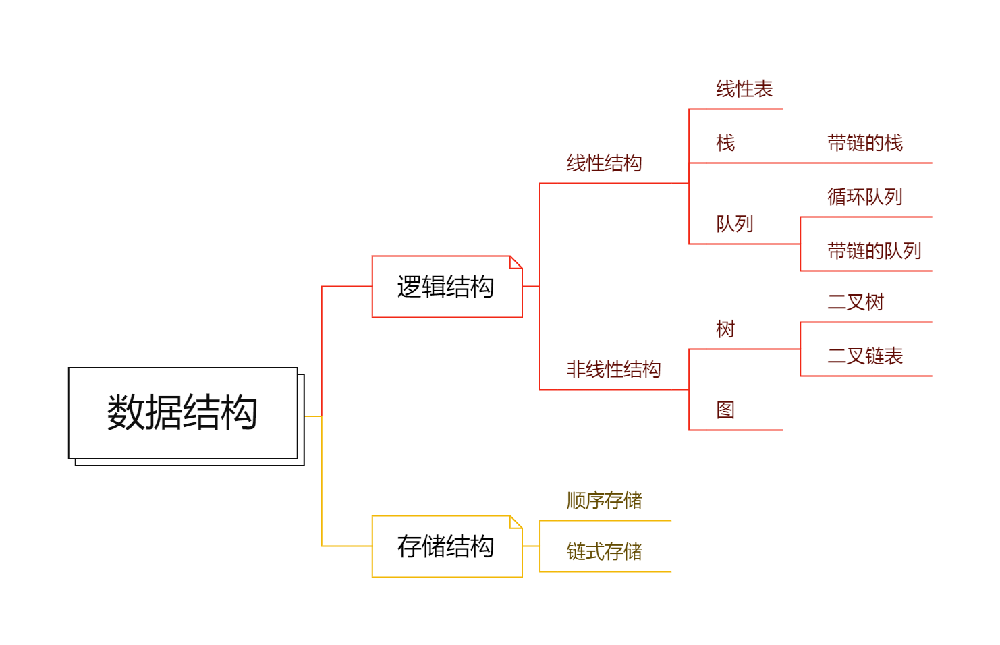

> 数据结构作为计算机的一门学科，主要研究三个方面：`数据间固有逻辑结构关系`、`数据的存储结构关系`、`数据结构的运算`

- 逻辑结构：反映数据元素之间的前后件逻辑关系的数据结构（与所使用的计算机无关）

  - 线性结构（线性表、栈、队列）
  - 非线性结构（树、图、二叉链表）

- 存储结构：即物理结构，数据的逻辑结构在计算机空间中的存放方式（不同的存储结构，数据处理的效率不同，`与效率有关`）

  - 顺序结构：主要用于线性的数据结构
  - 链式结构：每一个结点至少包含一个指针域，用指针的指向来体现数据元素之间在逻辑上的联系 ，优点是`便于插入和删除操作`
  - 索引结构：带有目录与内容

  > 没有根结点或没有叶子结点的数据结构一定是非线性结构。
  >
  > 所有数据结构不用必须有根结点或终端结点。

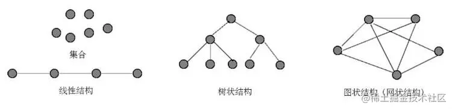

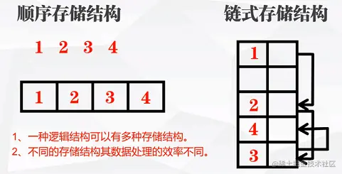

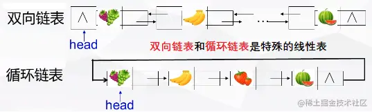

- 运算：插入、删除、查找、排序

## 线性表

- 线性表：由n(n≥0)个数据元素构成的有限序列，表中由且只有一个根结点和一个终端结点，除根元素外的其它元素有且只有一个前件，除终端元素外的其它元素有且只有一个后件（如：春→夏→秋→冬）
- 线性表的顺序存储结构叫做`顺序表`（随机存取），线性表的链式存储结构叫做`线性链表`（顺序存取）

### 顺序表

1. 线性表中所有元素所占的存储空间是`连续`的
2. 线性表中数据元素在存储空间中是`按逻辑顺序依次存放`的
3. 可以`随机访问`数据元素
4. 做插入、删除时需移动大量元素，因此线性表不便于插入和删除元素
5. 其存储空间连续，各个元素所占字节数相同，元素的存储顺序与逻辑顺序一致

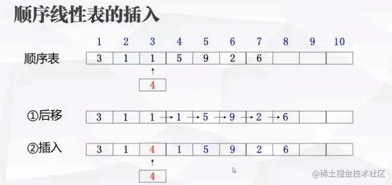

### 线性链表

1. 各数据结点的存储空间可以`不连续`
2. 各数据元素的存储顺序与逻辑顺序可以不一致，`可任意`
3. 所占存储空间`大于`顺序存储结构（每节点多出至少一个指针域）
4. 查找结点时要比顺序存储`慢`
5. 插入删除元素比顺序存储`灵活`

- 线性链表的操作：在线性链表中进行插入与删除，`不需要`移动链表中的元素

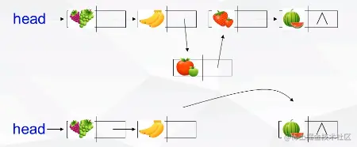

## 栈

1. 栈的入口和出口是`同一个口`，只能在`栈顶`进行`插入和删除`

2. 栈的修改原则是`“先进后出”`或`“后进先出”`

3. 栈的`栈底指针bottom`和`栈顶指针top`，从`入栈`到`栈满`再到`退栈`，`栈低指针bottom不变`，栈中元素随栈顶指针的变化而动态变化（指针存放的是地址而非数据）

4. 栈能临时保存数据，具有`记忆功能`

5. 栈支持子程序调用

   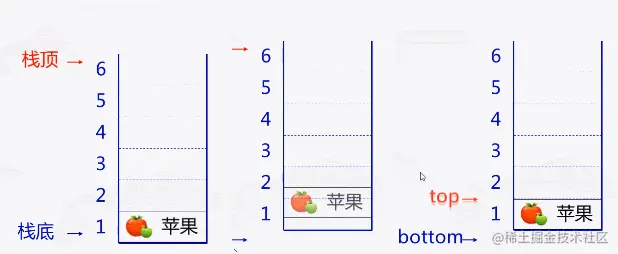

> 一个栈的初始状态为空。将元素abcde依次入栈，不可能的出栈顺序为（E）
>
> A.edcba	B.dcbae	C.badce	D.cbaed	E.eabcd

> 用一个长度为50的数组(数组元素的下标从0到49)作为栈的存储空间，如果bottom=49，top=30(数组下标)，则栈中具有的元素个数为【20】（49-30+1=20）
>
> 设栈的存储空间为S（1：60），初始状态为top=61。现经过一系列正常的入栈与退栈操作后，top=25，则栈中的元素个数为【36】（60-25+1=36）
>
> 栈内元素个数计算：`丨Top－Bottom丨＋1` （其中Bottom≥1），若T＝B＝0说明栈空

> 链式栈较特殊，当中存放元素与地址，但其栈底指针可以改变但不能省略
>
> 与顺序栈相比的优点：入栈操作时不会受栈存储空间的限制而发生溢出，不受空间大小的限制，不需要考虑栈满的问题

## 队列

1. 队列中`队头指针front`指向对头元素的`前一位置`，`队尾指针rear`指向最末元素，从`入队`到`出队`
2. 队列的入口和出口`非同一个口`，只允许在`队尾插入`，而在`队头删除`
3. 队列的修改原则是`“先进先出”`或`“后进后出”`（**先到先服务**的作业调度）
4. 队列中元素随front和rear的变化而动态变化，并非固定

#### 循环队列

- 将队列存储空间的最后一个位置绕到第一个位置，形成逻辑上的环状空间，供队列循环使用

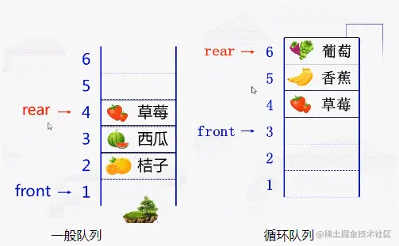

> 求队列中的`元素个数s`（由rear与front共同决定）
>
> 1. rear＞front		s=rear-front . rear＜front		s=rear-front+总容量 . rear＝front		s=0或者s=容量(满)

> 设循环队列的存储空间为Q（1:40），初始状态为front=rear=40。经过一系列正常的入队与退队操作后，front=rear=15，此后又正常地退出了一个元素，则循环队列中的元素个数为	【39】 （当头尾指针都是15之后还能退出元素，说明初始状态为满，故退出一个元素，即40-1=3）

## 树

- 树：指n(n＞0)个元素的有限集合，它有且仅有一个称为根的元素，其余元素是互不相交的子树

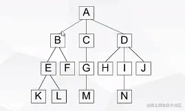

- 概念术语：
  - 父结点（A是BCD的父）、子结点（BCD是A的子)
  - 根结点（A）、叶子结点（KLFMHNJ）
  - 结点的度：一个结点所拥有的后件的个数（A的度为3、B的度为2）
  - 树的度：具有结点中最大的度（上图为3）
  - 树的深度：整棵树的层数（上图为4）
  - 子树：在一棵树中以某个结点的一个子结点为根所构成的树（如B→EF→KL这一左半部分）

### 二叉树

> 二叉树是一个有限的结点集合，该集合或为空，或由一个根结点及其两棵互不相交的左右二叉子树所组成，`二叉链表`是树的二叉链表实现方式。

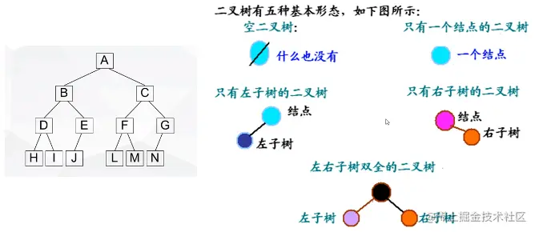

- 二又树的特点
  1. 非空二又树只有一个根结点
  2. 每一个结点最多有两棵子树，且分别称为该结点的左子树与右子树
- 特殊二叉树

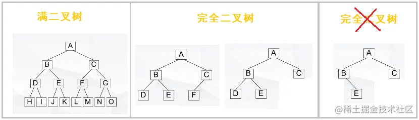

> 满二叉树：除最后一层外，每一层上的结点数均达到最大值。
>
> 完全二叉树：除最后一层外，每一层上的结点数均达到最大值，在最后一层上只缺少右边的若干结点
>
> > 满二叉树`是`完全二叉树，完全二叉树`不是`满二叉树

- 二叉树的性质：

  1. 非空二叉树只有一个根结点，每个结点最多有两棵子树，分别称为`左子树`和`右子树`
  2. 在二叉树的第k层上，最多有`2^(k-1)`个结点（指定第几层求结点）
  3. 深度为m的二叉树最多有`2^(m)-1`个结点（指定层数求结点）
  4. 度为0的结点称为`叶子结点`，度=0的结点总比度=2的结点`多1个`
  5. 有n个结点的二叉树深度至少为`[log(2)n]+1`（指定结点求深度）

- 二叉树的遍历：按照一定的顺序不重复不遗漏地访问二叉树中的结点

  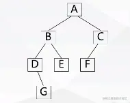

  > 前序遍历：访问根结点→前序遍历左子树→前序遍历右子树（ABDGECF）（根左右） 中序遍历：中序遍历左子树→访问根结点→中序遍历右子树（DGBEACF）（左根右） 后序遍历：后序遍历左子树→后序遍历右子树→访问根结点（GDEBFCA）（左右根）

