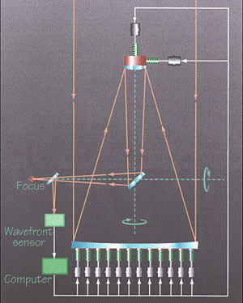
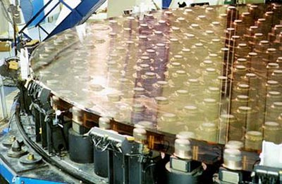
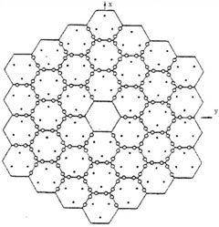
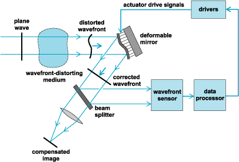
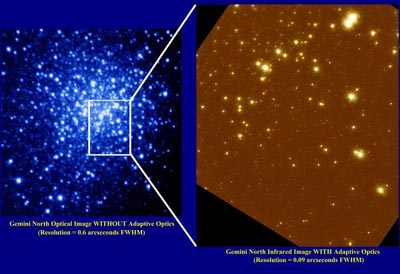
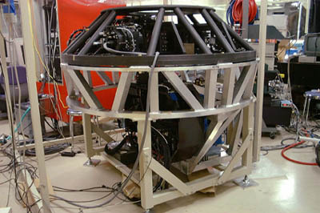

# 主动光学与自适应光学

<!--more-->

前番的[《关于望远镜镜坯》](http://bzhang.lamost.org/website/index.php?p=364)一文提到了目前望高面型精度反射镜的制造，但质量再好的望远镜也不可避免地受到重力、温度、大气湍动等因素的影响。对时下流行的弯月形薄镜面来说，自身的厚度不足以抵抗重力变形；而地球上最好的台址也不能完全克服大气的干扰：仅仅是对于4米望远镜，大气扰动就可以使其极限星等比衍射极限亮一等了。如此情况下，想要提高分辨率，增大望远镜口径和保证磨制精度固然重要，上述几个不利因素也必须要设法克服。

主动光学（Active Optics）和自适应光学（Adaptive Optics）就是以上问题的解决途径，二者在原理上有相似之处，干脆放在一起写好了。

不过首先要解释的是这两种技术的区别。早先本人一直是把二者混为一谈的，直到看到课本上将这两个名词并列印在一起，才意识到自己是犯了很多年的错误。主动光学是在1980年代发展起来的，它是在薄型主镜后方设有上百个计算机控制的促动器，随时监测并抵消重力变形、风力干扰和温度波动对成像的影响，调整频率约0.01至1赫兹。自适应光学主要补偿的则是大气湍动，调整频率可达每秒上百次，调整的对象也非主镜，而是光路中专门设置的一块变形辅助镜（大口径主镜难以承受高频调整）。

不论是主动光学还是自适应光学，工作时都需要实时检测星象。检测装置常采用沙克-哈特曼（Shack-Hartmann）光栏，这是一组小透镜组成的阵列，根据成像可以计算出各点上波前的扭曲程度并求得相应的改正量。此装置的一大优点是，待测天体不一定是点源，就算是太阳这样变化迅速的天体也照样可用（因此目前有一些太阳望远镜也采用了自适应光学系统）。沙克-哈特曼光栏的具体工作原理可参考实测天体物理学的相关书籍，在此不赘述。

以下分别说说主动光学和自适应光学技术。

　

## 主动光学

主动光学系统工作原理图。（图片提供：Ed Janssen, ESO）

最初运用主动光学系统的望远镜包括北欧光学望远镜、欧洲南方天文台新技术望远镜等中等口径设备，其中后者于1989年投入使用，是第一架全面采用主动光学技术的望远镜。所谓主动是相对传统的刚性厚反射镜而言的，后者并没有装配改善成像的设备，只是通过提高机械强度被动克服重力等不利影响。主动光学系统可以让望远镜主镜时刻保持最佳状态，克服影响成像的因素中与面形有关的一部分，故有“主动”之名。

使用主动光学的望远镜需要在光路中分出一束光线，将其引入沙克-哈特曼光栏检测装置。计算机检测出像差，计算准泽尼克多项式的系数，利用其与预先校正值之差来调整各促动器施力大小，并实时反馈。有的望远镜也备有开环改正机制，需要了解望远镜的受力和位置，适用于引导星亮度不足或是检测装置失灵等情况下的使用。

昴星团望远镜背面的促动器阵列。（图片提供：NAOJ）

而对于凯克望远镜这样的拼接镜面，主动光学系统更是保持面型的必需装置。由于单块子镜直径不大，受环境影响较小，故调节的重点不是子镜的面形，而是相对位置。凯克望远镜在这一点上是使用电容式的传感器来进行监测的。中国在建的LAMOST望远镜由于在观测不同的天体时需要不同的面形，也配备有主动光学系统来将改正板调整到所需要的形状上，这比单纯校正面型的传统主动光学又进了一步。实际上主动光学已用在了几乎所有新建的大中型望远镜上，可以将镜面精度保持在100埃或更高的量级上。

凯克望远镜的促动器分布，图中可见各子镜的接缝处是重点调整对象，子镜上的促动器则用于调节彼此的相对高度。

除用于望远镜系统外，主动光学还可以在法布里—珀罗干涉仪上使用。

　

## 自适应光学

自适应光学系统工作原理图。（图片来源：[Answers.com](http://www.answers.com/)）

自适应光学是Horace Babcock于1953年提出的，其原理并不复杂，小型试验也早在1960年代末就在威尔逊天文台进行过，观测对象为木星和土星。不过该技术的大范围运用要等到计算机和光学设计技术发达后的1990年代，其中SDI计划的解密对其起了很大的推动作用。与主动光学不同，自适应光学是依照大气湍动情况调整反射镜面形，以改正出射波前，而非将面形保持在最佳状态上。使用自适应光学后，望远镜的分辨率可以提高10倍以上。

自适应光学使用前（左）与使用后（右）拍摄的同一星团对比，左图分辨率约0.6角秒，右图为0.09角秒。（图片提供：Gemini Observatory, National Science Foundation, and the University of Hawai’i Adaptive Optics Group）

不过自适应光学的工作原理与主动光学还是比较类似的，也是从主光路中分束检测，通常是选择待测天体附近的一颗亮星作校准用引导星。计算机控制促动器调整的则是变形辅助镜。变形镜一般安置在望远镜焦点后方，口径8至20厘米，设有数百个促动器。促动器的具体数目取决于要求的调整精度和引导星的亮度，当然还有预算。

昴星团望远镜的自适应光学变形镜系统，安装在卡塞格林焦点处。（图片提供：NAOJ）

显然，对引导星的要求大大限制了自适应光学系统的观测范围，因为并非所有待测天体附近都有符合要求的亮星（亮度不低于12-15等），而且引导星与目标距离过大也会由于彼此大气湍动情况不同而使像质严重恶化。而小口径的变形镜也使自适应光学难以一次观测很大的天区，轻易加大变形镜又会带来一系列机械和材料方面的问题，如镜面碎裂的克服（大型双筒望远镜的变形镜就曾由于承受不住高频变化而破碎）。

这两个缺陷的解决方案分别是激光引导星和多共轭点（Multi-Conjugate）自适应光学系统。前者是向大气中间层发射激光，激发钠原子辐射出黄光，产生人工引导星。目前凯克、双子、昴星团、加拿大-法国-夏威夷望远镜、欧洲南方天文台等处均配备了激光引导星系统。不过这固然解决了引导星数量不足的问题，却也引来不少新麻烦：精确控制激光投射方位的难度、路过的飞机和卫星、较大的功率（意味着开支的大大增加）、每晚的军方批准，外加彼此的冲撞。至于后者，是在光路中设置数个变形镜来增大视场。另外大口径变形镜也正在开发中。

但由于调整频率过高、计算量过大以及对促动器需求量过多，目前自适应光学系统一般仅用于红外观测。举例来说，根据欧洲南方天文台的估计，如要使用自适应光学进行可见光观测，每架8米望远镜需要6000余个促动器，成本高不算，如何安置也是个不小的问题。但可见光的自适应光学系统已经为侦察卫星搭载的小口径望远镜所采用。

　

主动光学和自适应光学是现代大型地面望远镜的制胜法宝。凭借这两项技术，衍射极限不再是空想，而地面望远镜的表现也足以胜过空间望远镜。当然，技术目前并不成熟，特别是自适应光学，需要解决的问题仍旧很多，激光引导星与多共轭点自适应光学也仍处在发展初期，但凭借主动光学和自适应光学已经取得了许多新发现，而对于未来计划中的数十米乃至上百米的巨型望远镜，这二者更是必备的。

　

参考资料：

[1] [An introduction to Active & Adaptive Optics](http://www.eso.org/aot/introduction.html)
[2] [The VLT Active Optics System](http://www.eso.org/projects/vlt/unit-tel/actopt.html)
[3] [Mauna Kea不再闪烁的星光](http://bzhang.lamost.org/website/index.php?p=349)
[4] [Adaptive Optics - Straightening Out Bent Starlight](http://www.gemini.edu/public/adaptive.html)
[5] [Dr. Olivier Lai’s View Graphs on Adaptive Optics](http://www.cfht.hawaii.edu/Instruments/Imaging/AOB/local_tutorial.html)
[6] 《实测天体物理学》，郑兴武 编

> 原文链接：http://bzhang.lamost.org/website/archives/modern_instr_ao/
